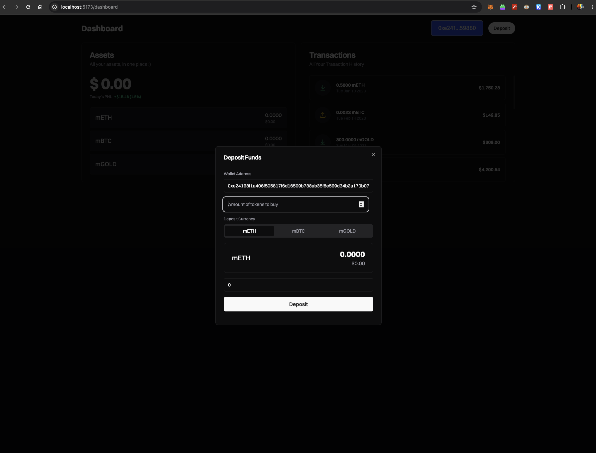
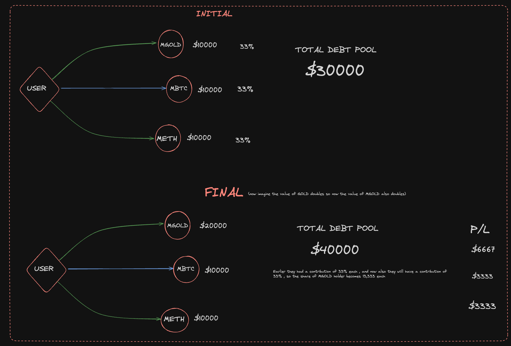

<!-- Improved compatibility of back to top link: See: https://github.com/othneildrew/Best-README-Template/pull/73 -->

<!-- PROJECT LOGO -->
 

  

<h1 align="center">MovrSync</h3>

  

  Welcome to MovrSync, developed for the Movement Labs Devnet. This decentralized application (dApp) offers a groundbreaking way to trade real-world assets (RWAs) within the Aptos ecosystem through synthetic assets.

 

Our dApp enables users to create synthetic assets for RWAs in the form of tokens, eliminating the need for direct ownership of the physical assets. This functionality mirrors the mechanics of a derivatives market.

## Key Features

### Synthetic Asset Creation

- **Deposit Tokens**: Users can deposit MOVE or APT tokens.
- **Mint Synthetic Assets**: Upon deposit, users are minted synthetic tokens: MBTC, METH, or MGOLD, depending on their choice.
- **Pegged to RWA Values**: These synthetic tokens are pegged to the corresponding RWA values.

### Collateralization

- **Collateralization Ratio**: Each deposit is collateralized at a specific ratio.
- **Maintaining Peg**: The collateralization process ensures that the synthetic tokens maintain their peg to the RWA values.

### Global Debt Pool

- **Debt Pool Contribution**: The synthetic assets are added to a global debt pool.
- **Share Calculation**: Each user’s share of the debt pool is calculated based on their contribution.
- **Profit and Loss**: As the value of the global debt pool fluctuates, so do the users’ profits and losses, proportionate to their share.

<!-- ## Benefits

- **Access to RWAs**: Users gain exposure to real-world assets without the complexities of direct ownership.
- **Leverage**: Users can leverage their MOVE or APT tokens to gain synthetic exposure to BTC, ETH, and Gold.
- **Decentralization**: The entire process is managed on the blockchain, ensuring transparency and security. -->

## Working 

<h3>Example</h3>

Above here is an example to demonstrate the working of MovrSync , The person's deposited amount is added to the total debt pool and the profit and loss
is calculated on the basic of the person's percentage contribution to the debt pool and P/L is calculated on that basis.

I believe the benefit of using this is that you can minimize your losses with the trade off of losing out on some of your potential profits.
  
This might not seem optimal, but when it comes to losses, they are also minimized.  

So basically, you can minimize risk while minimizing reward and then the competitor’s loss is your reward and their reward is your loss.
1. **Home Page**:
   - Users land on the home page of the dApp.

2. **User Dashboard**:
   - Users navigate to the user dashboard where they can connect their Petra wallet to the dApp.

3. **Deposit Modal**:
   - Users click on the "Deposit" button, which opens a modal.
   - In the modal, users can choose the amount of synthetic tokens they want to buy.
   - As users fill in the amount, the required deposit in MOVE tokens is calculated and displayed.

4. **Collateralization Calculation**:
   - Under the hood, a JavaScript function is called.
   - This function interacts with the smart contract to extract the collateralization ratio.
   - The collateralization ratio is based on the volatility of the resource over the past 24 hours.

5. **Token Minting**:
   - Once the user deposits the required MOVE tokens, they receive their synthetic tokens (e.g., MBTC).

6. **Pegging to Real World Value**:
   - The MBTC token is pegged to the real value of BTC using the Pyth oracle.
   - The real-world value can be realized through our liquidity pools, funded by the MOVE tokens deposited by users.

7. **Profit and Loss Calculation**:
   - As the value of MBTC changes, the vault manager contract calculates the user's percentage of the total debt pool.
   - The user's corresponding profit or loss is then determined based on the change in the debt pool value.

## Challenges

During the development of MovrSync, several challenges were encountered:

1. **Pyth Oracle Integration**:
   - The Pyth oracle was not working on the Movement Devnet.
   - This necessitated the use of an External API in JavaScript to calculate the individual user's loss and profit.

2. **Token Visibility in Petra Wallet**:
   - Tokens were not showing up on the Petra wallet, causing significant distractions and complications during development.

3. **New Ecosystem**:
   - This was the first time working on the Aptos ecosystem, making the entire development process a learning curve.

4. **Real-life Token Value**:
   - The inability to add real-life value to the tokens due to the devnet environment posed limitations. Actual token values were required for full functionality.
   

<!-- LICENSE -->

## License

Distributed under the MIT License. See `LICENSE.txt` for more information.

<!-- MARKDOWN LINKS & IMAGES -->
<!-- https://www.markdownguide.org/basic-syntax/#reference-style-links -->

[contributors-shield]: https://img.shields.io/github/contributors/Sahilgill24/MovrSync.svg?style=for-the-badge
[contributors-url]: https://github.com/Sahilgill24/MovrSync/graphs/contributors
[forks-shield]: https://img.shields.io/github/forks/Sahilgill24/MovrSync.svg?style=for-the-badge
[forks-url]: https://github.com/Sahilgill24/MovrSync/network/members
[stars-shield]: https://img.shields.io/github/stars/Sahilgill24/MovrSync.svg?style=for-the-badge
[stars-url]: https://github.com/Sahilgill24/MovrSync/stargazers
[issues-shield]: https://img.shields.io/github/issues/Sahilgill24/MovrSync.svg?style=for-the-badge
[issues-url]: https://github.com/Sahilgill24/MovrSync/issues
[license-shield]: https://img.shields.io/github/license/Sahilgill24/MovrSync.svg?style=for-the-badge
[license-url]: https://github.com/Sahilgill24/MovrSync/blob/master/LICENSE.txt
[linkedin-shield]: https://img.shields.io/badge/-LinkedIn-black.svg?style=for-the-badge&logo=linkedin&colorB=555
[linkedin-url]: https://linkedin.com/in/linkedin_username
[product-screenshot]: images/image.png
[frost-screenshot]: images/frost.png
[architecture]: images/architecture.png
[Next.js]: https://img.shields.io/badge/next.js-000000?style=for-the-badge&logo=nextdotjs&logoColor=white
[Next-url]: https://nextjs.org/
[React.js]: https://img.shields.io/badge/React-20232A?style=for-the-badge&logo=react&logoColor=61DAFB
[React-url]: https://reactjs.org/
[Vue.js]: https://img.shields.io/badge/Vue.js-35495E?style=for-the-badge&logo=vuedotjs&logoColor=4FC08D
[Vue-url]: https://vuejs.org/
[Angular.io]: https://img.shields.io/badge/Angular-DD0031?style=for-the-badge&logo=angular&logoColor=white
[Angular-url]: https://angular.io/
[Svelte.dev]: https://img.shields.io/badge/Svelte-4A4A55?style=for-the-badge&logo=svelte&logoColor=FF3E00
[Svelte-url]: https://svelte.dev/
[Laravel.com]: https://img.shields.io/badge/Laravel-FF2D20?style=for-the-badge&logo=laravel&logoColor=white
[Laravel-url]: https://laravel.com
[Bootstrap.com]: https://img.shields.io/badge/Bootstrap-563D7C?style=for-the-badge&logo=bootstrap&logoColor=white
[Bootstrap-url]: https://getbootstrap.com
[JQuery.com]: https://img.shields.io/badge/jQuery-0769AD?style=for-the-badge&logo=jquery&logoColor=white
[JQuery-url]: https://jquery.com